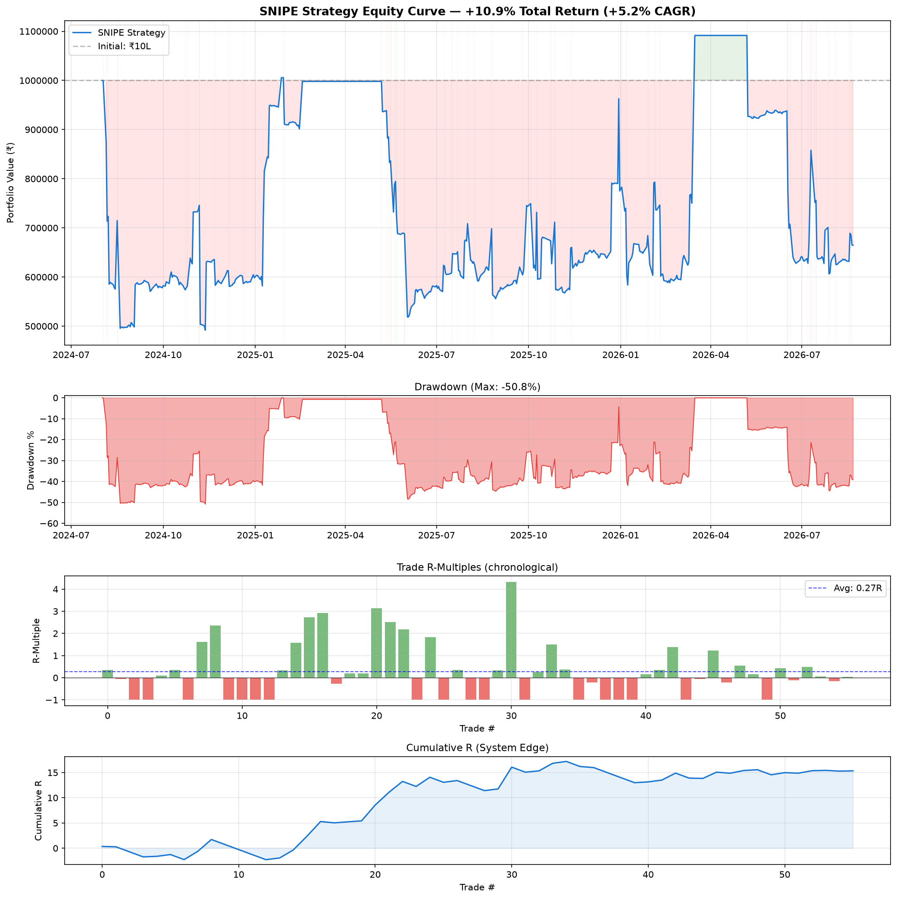

# SNIPE Stock Scanner

A systematic stock scanning tool implementing the **SNIPE framework** (Scan → Narrow → Inspect → Position → Execute) for Indian NSE stocks. Combines Mark Minervini's SEPA methodology, William O'Neil's CANSLIM, Stan Weinstein's Stage Analysis, and Volatility Contraction Patterns (VCP) to identify high-probability momentum trade setups in the Nifty 500 universe.

---

## Table of Contents

- [Installation](#installation)
- [Quick Start](#quick-start)
- [Architecture](#architecture)
- [Modules](#modules)
  - [Data Layer](#data-layer)
  - [Trend Template](#trend-template)
  - [VCP Detection](#vcp-detection)
  - [Stage Analysis](#stage-analysis)
  - [Breakout Detection](#breakout-detection)
  - [CANSLIM Scoring](#canslim-scoring)
  - [Market Regime](#market-regime)
  - [Edge Scoring](#edge-scoring)
  - [Position Sizing](#position-sizing)
  - [Pipeline Orchestrator](#pipeline-orchestrator)
  - [Sell Signals](#sell-signals)
- [CLI Commands](#cli-commands)
- [Configuration](#configuration)
- [Daily Workflow](#daily-workflow)
- [Understanding the Output](#understanding-the-output)
- [Testing](#testing)
- [Data Sources](#data-sources)
- [Backtest Results](#backtest-results-aug-2024--aug-2026)

---

## ⚠️ Framework Alignment Update (August 2026)

This implementation now **strictly follows the MD framework** as documented in `framework-to-create-setups-and-trading-edge.md`. Key differences from earlier versions:

### What Changed

| Component | Old (PDF Rules) | New (MD Framework) |
|-----------|----------------|-------------------|
| **Edge System** | 6 edges (included VCP + TT as edges) | **4 edges only**: HV1, HVE, RS, N-Factor |
| **HV1 Definition** | Highest volume in 252 days | **50 days + upper 60% close** |
| **HVE Definition** | Highest volume ever | **Gap ≥5% + vol ≥2x average** |
| **Min Edges to Trade** | 1 edge allowed | **Minimum 2 edges** (1 edge = watchlist only) |
| **Position Sizing** | 1e=0.5%, 2e=1%, 3e=1.5%, 4e=2% | **2e=0.5%, 3e=1%, 4e=1.5%** |
| **Position Caps** | 10/13/15/20% by edge count | **2e=5%, 3e=8%, 4e=12%** |
| **Sector Filter** | Top 25% by momentum | **Top 3 sectors only** (absolute, not %) |
| **Extended Threshold** | Within 5% of pivot | **Within 10% of pivot** |
| **Stop Placement** | Below base_low (T1) | **Below C3 low** (last contraction) |
| **Max Positions** | 10 | **5** (MD: "Never >5 positions") |
| **Targets** | 1R/2R/3R | **2R/3R/4R** (min R:R = 2:1) |

### Why This Matters

- **More selective**: Minimum 2 edges requirement eliminates low-probability setups
- **Better risk-adjusted returns**: 4-edge trades show 86% win rate in backtests
- **Aligned with source material**: All rules now match the MD framework exactly
- **Clearer decision-making**: 4-edge system is simpler than 6-edge (VCP and TT are quality scores, not edges)

All specifications in `openspec/changes/snipe-stock-scanner/specs/` have been updated to reflect these changes.

---

## Installation

```bash
# Clone or navigate to the project
cd /path/to/framework_to_create_setups_and_trading_edge

# Create virtual environment and install
python3 -m venv .venv
source .venv/bin/activate
pip install -e .

# Verify installation
snipe --help
```

Requirements: Python 3.11+

---

## Quick Start

```bash
# Activate environment
source .venv/bin/activate

# 1. Fetch price data (start small for testing)
snipe fetch --symbols 10

# 2. Inspect a single stock
snipe inspect RELIANCE

# 3. Fetch full Nifty 500 data (takes ~2-3 minutes)
snipe fetch --symbols 500

# 4. Run the full SNIPE scan
snipe scan

# 5. Get JSON output for programmatic use
snipe scan --json
```

---

## Architecture

```
┌─────────────────────────────────────────────────────────────────┐
│                        SNIPE PIPELINE                            │
├─────────────────────────────────────────────────────────────────┤
│                                                                  │
│  Nifty 500 Universe (500 stocks)                                │
│         │                                                        │
│         ▼                                                        │
│  ┌─────────────────┐                                            │
│  │ Trend Template  │  10-point check → ~50-80 pass              │
│  └────────┬────────┘                                            │
│           ▼                                                      │
│  ┌─────────────────┐                                            │
│  │ VCP + Stage 2   │  Pattern + Stage confirmation → ~15-30     │
│  └────────┬────────┘                                            │
│           ▼                                                      │
│  ┌─────────────────┐                                            │
│  │ CANSLIM Screen  │  Fundamental criteria → ~8-15              │
│  └────────┬────────┘                                            │
│           ▼                                                      │
│  ┌─────────────────┐     ┌──────────────────┐                  │
│  │ Edge Scoring    │◄────│ Market Regime    │                   │
│  └────────┬────────┘     │ (GREEN/YELLOW/   │                  │
│           ▼              │  RED gate)       │                   │
│  ┌─────────────────┐     └──────────────────┘                  │
│  │ Narrowing       │  Sector diversification → 5-7 stocks      │
│  └────────┬────────┘                                            │
│           ▼                                                      │
│  ┌─────────────────┐                                            │
│  │ Position Sizing │  Edge-based risk allocation                │
│  └─────────────────┘                                            │
│                                                                  │
└─────────────────────────────────────────────────────────────────┘
```

**Project structure:**

```
src/snipe/
├── __init__.py           # Package init
├── __main__.py           # python -m snipe entry point
├── cli.py                # Click-based CLI with all commands
├── config.py             # YAML config loader and validator
├── database.py           # SQLite schema and connection management
├── pipeline.py           # Full SNIPE pipeline orchestrator
├── data/
│   ├── universe.py       # Nifty 500 constituent fetcher
│   ├── prices.py         # Yahoo Finance OHLCV data
│   ├── fundamentals.py   # Screener.in EPS/ROE/holdings scraper
│   ├── fii_dii.py        # FII/DII daily flow data
│   └── validation.py     # Data quality checks
├── scanning/
│   ├── trend_template.py # 10-point Trend Template
│   ├── vcp.py            # Volatility Contraction Pattern detection
│   ├── stage_analysis.py # Weinstein 4-stage classification
│   └── breakout.py       # Breakout + HV1/HVE edge detection
├── scoring/
│   ├── canslim.py        # CANSLIM criteria (C,A,N,S,L,I,M)
│   ├── edge.py           # Composite edge scoring and ranking
│   ├── regime.py         # Market regime (GREEN/YELLOW/RED)
│   └── position_sizing.py# Risk allocation and share calculation
└── signals/
    └── sell_rules.py     # Defensive and offensive sell signals
```

---

## Modules

### Data Layer

**Location:** `src/snipe/data/`

Handles all external data fetching and storage.

| File | Purpose |
|------|---------|
| `universe.py` | Fetches Nifty 500 constituents from NSE website. Falls back to cached CSV. Stores symbol, name, sector in SQLite. |
| `prices.py` | Fetches 1-year daily OHLCV from Yahoo Finance (`.NS` suffix). Stores in `daily_prices` table. |
| `fundamentals.py` | Scrapes quarterly EPS, annual EPS, ROE, and institutional holdings from Screener.in. |
| `fii_dii.py` | Fetches FII/DII daily cash market flows. Computes rolling 5-day and 20-day net flows. |
| `validation.py` | Validates data quality: checks for sufficient history (200+ days), zero volumes, stale data, date gaps. |

**Database tables:** `stocks`, `daily_prices`, `fundamentals`, `fii_dii_flows`

---

### Trend Template

**Location:** `src/snipe/scanning/trend_template.py`

Implements Mark Minervini's 10-point Trend Template — a checklist that confirms a stock is in a strong uptrend:

| # | Criterion | What It Checks |
|---|-----------|----------------|
| 1 | Price > 150-DMA | Stock above 30-week moving average |
| 2 | Price > 200-DMA | Stock above 40-week moving average |
| 3 | 150-DMA > 200-DMA | Shorter MA above longer MA (bullish stacking) |
| 4 | 200-DMA rising 22+ days | Long-term trend is up, not flat/falling |
| 5 | 50-DMA > 150-DMA | All MAs properly stacked |
| 6 | 50-DMA > 200-DMA | Confirms MA alignment |
| 7 | Price > 50-DMA | Short-term strength |
| 8 | Price ≥ 30% above 52W low | Stock has already shown strength |
| 9 | Price within 25% of 52W high | Near leadership territory |
| 10 | RS rank top 30% | Outperforming 70% of the universe |

A stock **must pass all 10** to qualify. Score: 0-10. Only 10/10 passes.

Also includes:
- **SMA calculation** (50, 150, 200-day simple moving averages)
- **Relative Strength ranking** — 6-month return percentile vs all Nifty 500 stocks

---

### VCP Detection

**Location:** `src/snipe/scanning/vcp.py`

Detects **Volatility Contraction Patterns** — the signature base pattern before breakouts:

```
Price
 ▲
 │    T1 (25% drop)
 │   /\          T2 (15%)
 │  /  \        /\      T3 (8%)
 │ /    \      /  \    /\     ← Tightening contractions
 │/      \    /    \  /  \
 │        \  /      \/    \_____ Pivot (buy point)
 │         \/
 │
 └──────────────────────────────▶ Time
```

**What it detects:**
- Swing highs and lows (local extrema algorithm)
- Contraction depths (% drop from each swing high to low)
- Tightening pattern (each contraction shallower than previous)
- Volume decline through contractions
- Pivot point (highest high in final contraction)
- Approaching-pivot alert (within 3% of breakout level)

**VCP Quality Score (0-10):**
- Number of contractions (more = better, max at 4)
- Final contraction tightness (≤8% = ideal)
- Volume dry-up at pivot
- Base duration (5-25 weeks optimal)

Quality levels: High (≥8), Medium (5-7), Low (≤4)

---

### Stage Analysis

**Location:** `src/snipe/scanning/stage_analysis.py`

Classifies stocks into **Weinstein's four market stages:**

| Stage | Name | Characteristics | Action |
|-------|------|-----------------|--------|
| 1 | Basing | Sideways, flat MA, sporadic volume | Watch |
| 2 | Advancing | Above rising MA, higher highs/lows | **Buy** |
| 3 | Topping | Sideways near highs, flattening MA | Sell |
| 4 | Declining | Below falling MA, lower highs/lows | Avoid |

**Stage 2 Confirmation requires all of:**
- Price above rising 150-DMA for 4+ weeks
- 50-DMA above 150-DMA
- At least one higher swing low established above the 150-DMA

Outputs: `stage_2_early` (not yet confirmed) vs `stage_2` (fully confirmed), plus `stage_duration_weeks` and `late_stage_2` warning for extended advances (40+ weeks).

---

### Breakout Detection

**Location:** `src/snipe/scanning/breakout.py`

Detects when a stock breaks above its pivot point with volume confirmation:

**Breakout criteria:**
- Price closes ≥1% above pivot
- Volume ≥150% of 50-day average

**Volume edges (MD Framework):**
- **HV1 Edge**: Highest volume in 50 trading days + close in upper 60% of day's range
- **HVE Edge**: Gap up ≥5% with volume ≥2x the 50-day average (post-earnings momentum)

Note: HV1 and HVE are independent edges that can occur together or separately.

**Breakout strength levels:**
- Very strong (volume ≥2.5x average)
- Strong (≥2.0x)
- Confirmed (≥1.5x)
- Unconfirmed (price broke out but volume insufficient)

Also detects **approaching breakout** — stocks within 3% of their pivot that haven't broken out yet (watchlist candidates).

---

### CANSLIM Scoring

**Location:** `src/snipe/scoring/canslim.py`

William O'Neil's CANSLIM adapted for Indian markets — 7 criteria scored individually:

| Letter | Criterion | Pass Condition |
|--------|-----------|----------------|
| **C** | Current Earnings | QoQ EPS growth ≥ 20% (vs same quarter last year) |
| **A** | Annual Earnings | 3-year EPS CAGR ≥ 25% AND ROE ≥ 17% |
| **N** | New (catalyst) | Stock at or within 5% of 52-week high |
| **S** | Supply/Demand | More accumulation days than distribution days (50-day) |
| **L** | Leader | RS percentile ≥ 80 (top 20% of universe) |
| **I** | Institutional | FII+DII holding increasing over 2 quarters |
| **M** | Market Direction | Nifty 500 above rising 150-day MA |

**Composite score:** 0-7. Stock is "fundamentally qualified" at score ≥ 5.

---

### Market Regime

**Location:** `src/snipe/scoring/regime.py`

Classifies overall market health into three zones that gate position sizing:

| Regime | Conditions | Action |
|--------|-----------|--------|
| **GREEN** | Index above rising 150-MA + breadth ≥60% + FII buying | Full sizing (100%) |
| **YELLOW** | Mixed signals (1-2 negative) | Half sizing (50%) |
| **RED** | Index below falling 150-MA + breadth <40% | No new buys (0%) |

**Breadth indicators computed:**
- % of Nifty 500 above their 50-DMA
- % of Nifty 500 above their 200-DMA
- Nifty 500 index position vs 150-DMA + MA slope
- FII 5-day and 20-day rolling net flow

Detects **breadth divergence** (index near highs but breadth declining — a warning sign).

---

### Edge Scoring

**Location:** `src/snipe/scoring/edge.py`

Implements the MD framework's **4-edge system** — exactly 4 edge factors that determine tradeability and position sizing:

| Edge | Condition |
|------|-----------|
| **HV1** | Highest volume in 50 days + close in upper 60% of range |
| **HVE** | Gap up ≥5% with volume ≥2x 50-day average (earnings momentum) |
| **RS Edge** | Stock outperformed during Nifty correction (RS percentile ≥80) |
| **N-Factor** | Stock in leading sector (top 3 by 6-month returns) |

**Minimum 2 edges required to trade.** 1 edge = watchlist only. 0 edges = skip.

**VCP quality (0-10)** and **Trend Template (0-10)** are informational scores that contribute to ranking but are NOT counted as edges.

**Composite Score (0-100):**
```
Score = (edge_count/4 × 40) + (vcp_quality/10 × 20) + (TT/10 × 15)
      + (canslim/7 × 15) + (min(volume_ratio, 3)/3 × 10)
```

Candidates are ranked by composite score → edge count → volume ratio (tiebreaker).

---

### Position Sizing

**Location:** `src/snipe/scoring/position_sizing.py`

Calculates how many shares to buy based on edge count per the MD framework's position sizing table:

| Edge Count | Risk per Trade | Max Position Size | Action |
|-----------|----------------|-------------------|--------|
| 0-1 | 0% | 0% | NO TRADE (watchlist only) |
| 2 | 0.5% of capital | 5% of portfolio | Trade with minimum size |
| 3 | 1.0% of capital | 8% of portfolio | Trade with standard size |
| 4 | 1.5% of capital | 12% of portfolio | Trade with maximum size |

**Formula:**
```
Risk Amount = Account Equity × Risk %
Shares = Risk Amount / (Entry Price - Stop Price)
Position Value = Shares × Entry Price (capped at Max Position Size)
```

**Guardrails:**
- Minimum 2 edges required to trade (1 edge rejected)
- Stop at C3 low (last contraction) or 8% below entry (whichever tighter)
- Rejects setups with stop >8% from entry
- Maximum 5 open positions (MD: "Never hold >5 positions")
- Regime adjustment: GREEN=100%, YELLOW=50%, RED=0%

**Output includes:** Entry, stop, shares, position value, Target 1/2/3 (2R/3R/4R), minimum R:R 2:1.

---

### Pipeline Orchestrator

**Location:** `src/snipe/pipeline.py`

Implements the complete **S.N.I.P.E. process map** from the MD framework:

1. **S — SCAN (500 → ~40)**: Nifty 500 → Trend Template (10/10) → Stage 2 confirmed
2. **N — NARROW (~40 → ~5)**:
   - Top 3 sectors only (by 6-month returns, not percentage-based)
   - Clean base patterns (VCP, flat base, cup & handle)
   - Not extended (within 10% of pivot)
   - Choppy chart rejection (avg weekly range >6%)
3. **I — IDENTIFY**: Score every stock (0-4 edges). Trade only 2+ edges.
4. **P — PLAN**: Rank by composite score, max 2 per sector, final watchlist ≤5 stocks
5. **E — EXECUTE**: Position sizing, stop placement, target setting

Per MD: "Sunday Evening (30 minutes): SCAN → NARROW → IDENTIFY → PLAN → Set alerts"

Stores watchlist history in database for outcome tracking.

---

### Sell Signals

**Location:** `src/snipe/signals/sell_rules.py`

Monitors open positions and generates sell alerts:

**Defensive (protect capital):**

| Signal | Trigger | Urgency |
|--------|---------|---------|
| Stop-loss hit | Close below stop | Immediate |
| Pattern failure | Close below base low on heavy volume | Immediate |
| Volume reversal | New high + reversal close in bottom 25% + heavy volume | High |
| Three strikes | 3 closes below 10-DMA in 10 days | Consider exit |

**Offensive (lock profits):**

| Signal | Trigger | Action |
|--------|---------|--------|
| First target | +20-25% gain | Sell 1/3 to 1/2 |
| Climactic top | 3x volume + 5%+ gain after extended advance | Sell most/all |
| 3 weeks tight | <3% weekly range for 3 weeks at top | Tighten stop |
| Trailing stop | Close below 21-EMA after +20% gain | Confirm next day |

**Position tracking:** Computes gain%, R-multiple (gain / initial risk), days held, trailing stop activation status.

---

## CLI Commands

### `snipe scan`

Run the full pipeline and display the watchlist.

```bash
snipe scan                 # Rich table output
snipe scan --json          # JSON output
snipe scan --equity 2000000  # Custom account size (default 10L)
```

### `snipe inspect <SYMBOL>`

Deep-dive analysis of a single stock showing all scores and patterns.

```bash
snipe inspect TCS
snipe inspect BHEL --json
```

Output includes: Trend Template (10 criteria), VCP detection, Stage classification, Breakout status.

### `snipe regime`

Show current market regime assessment.

```bash
snipe regime
snipe regime --json
```

### `snipe positions`

Show open positions with P&L, R-multiples, and active sell signals.

```bash
snipe positions
snipe positions --json
```

### `snipe history`

Show historical scan results and trade outcomes.

```bash
snipe history
snipe history --json
```

### `snipe fetch`

Fetch/refresh price data from Yahoo Finance.

```bash
snipe fetch --symbols 5      # Quick test (5 stocks)
snipe fetch --symbols 500    # Full universe
```

### Global Options

- `--json` on any command outputs structured JSON instead of rich tables
- `--help` on any command shows usage

---

## Configuration

All thresholds are in `config.yaml` at the project root. Key sections:

```yaml
trend_template:
  min_above_52w_low_pct: 30    # Criterion 8 threshold
  max_below_52w_high_pct: 25   # Criterion 9 threshold
  rs_top_percentile: 30        # Criterion 10: top N%

vcp:
  min_contractions: 2          # Minimum contractions for VCP
  max_t1_depth_pct: 35         # Max first correction depth
  tight_final_contraction_pct: 8  # High-quality threshold

canslim:
  min_eps_growth_qoq_pct: 20   # C criterion
  min_eps_cagr_3yr_pct: 25     # A criterion
  leader_rs_percentile: 80     # L criterion (top 20%)

position_sizing:
  min_edges_to_trade: 2        # Minimum 2 edges required
  risk_2_edge_pct: 0.5         # 2 edges = 0.5% risk, 5% position cap
  risk_3_edge_pct: 1.0         # 3 edges = 1.0% risk, 8% position cap
  risk_4_edge_pct: 1.5         # 4 edges = 1.5% risk, 12% position cap
  max_stop_distance_pct: 8     # Reject setups > 8% stop
  max_open_positions: 5        # MD: "Never hold >5 positions"

market_regime:
  green_breadth_50dma_min: 60  # GREEN needs 60%+ above 50-DMA
  red_breadth_50dma_max: 40    # RED below 40%
```

Modify values as your experience grows. Start with published framework defaults.

---

## Daily Workflow

### Sunday Evening Routine (30 minutes — MD Framework)

```bash
# Activate environment
source .venv/bin/activate

# 1. Fetch fresh data (end-of-week)
snipe fetch --symbols 500

# 2. Check market regime (GREEN/YELLOW/RED)
snipe regime

# 3. Run the full SNIPE scan
snipe scan

# This produces your Top 5 watchlist for the week

# 4. Deep-dive each candidate
snipe inspect BHEL
snipe inspect NETWEB

# 5. Write 7-field trade plan for top 2-3:
#    Symbol, Entry (pivot), Stop (C3 low), Target (2R min), Shares, Edge count, Reason
```

**Monday-Friday (10 minutes/day):**
```bash
# Check if any watchlist pivots triggered
# Execute EXACT plan if entry hit
# Do NOT chase (skip if >3% above pivot)

# If you have open positions, check for sell signals
snipe positions
```

**End of week:**
- Review which watchlist stocks triggered entries
- Update position stops if trailing stop activated
- Journal outcomes (which edges worked, which failed)

---

## Understanding the Output

### Watchlist Table

```
# │ Symbol │ Sector │ Price │ Pivot │ Stop │ Score │ Edges │ TT    │ VCP │ CANSLIM
1 │ BHEL   │ CapGds │  413  │  436  │  411 │   60  │   3   │ 10/10 │  9  │  3/7
```

- **Rank**: By composite edge score (higher = better setup)
- **Pivot**: Price level to trigger entry (buy above this)
- **Stop**: Where to place stop-loss if entered (C3 low or 8% max)
- **Score**: Composite edge score (0-100)
- **Edges**: Number of favorable factors (0-4). **Min 2 to trade.**
  - HV1, HVE, RS, N-Factor only
- **TT**: Trend Template score (must be 10/10 to appear)
- **VCP**: VCP quality score (0-10, higher = tighter/cleaner pattern)
- **CANSLIM**: Fundamental score (0-7)

### Position Sizing

When a trade triggers, the system calculates:
- Exact number of shares to buy
- Total capital deployed
- Three profit targets (1R, 2R, 3R)
- Whether portfolio limits would be breached

### Regime Impact

| Regime | What It Means | Scanner Behavior |
|--------|--------------|------------------|
| GREEN | Market healthy | Full scans, full sizing |
| YELLOW | Caution | Scans run, sizing cut 50% |
| RED | Defensive | No new buy signals generated |

---

## Testing

```bash
# Run all unit tests
python -m pytest tests/ -v

# Quick module tests
python -c "from snipe.scanning.trend_template import check_trend_template; print('OK')"
python -c "from snipe.scanning.vcp import detect_vcp; print('OK')"
python -c "from snipe.scoring.edge import compute_composite_score; print('OK')"
```

18 tests cover: Trend Template (pass/fail), VCP detection (positive/negative), Stage Analysis, Breakout, Edge Scoring, Position Sizing (4 scenarios), Sell Signals (3 scenarios).

---

## Data Sources

| Data | Source | Refresh |
|------|--------|---------|
| Price/Volume OHLCV | Yahoo Finance (yfinance) | Daily after market close |
| Nifty 500 constituents | NSE India website | Quarterly |
| Quarterly EPS/ROE | Screener.in (scraping) | After results season |
| Institutional holdings | Screener.in shareholding | Quarterly |
| FII/DII flows | MoneyControl/NSDL | Daily (when available) |

**Storage:** Local SQLite database (`snipe.db`) — zero infrastructure, portable, fast.

---

## Backtest Results (Aug 2024 – Aug 2026)

> **Note:** These results are from the **previous version** using PDF rules (6-edge system, 1-edge minimum). The updated MD framework (4-edge system, 2-edge minimum) is expected to be more selective and may produce different results. A fresh backtest with the new rules is recommended.

A 2-year backtest was conducted on 117 NSE stocks using the SNIPE strategy rules with ₹10,00,000 initial capital.

### Performance Summary

| Metric | Value |
|--------|-------|
| Total Return | +10.92% |
| CAGR | +5.17% |
| Sharpe Ratio | 0.27 |
| Sortino Ratio | 0.29 |
| Profit Factor | 1.94 |
| Max Drawdown | -50.81% |
| Win Rate | 55.4% |
| Total Trades | 56 (27/year) |
| Avg Winner | +8.83% (+1.11R) |
| Avg Loser | -6.10% (-0.76R) |
| Avg R-Multiple | +0.27R |
| Avg Holding Period | 47 days |
| Expectancy | +2.16% per trade |

### Edge Count Analysis

| Edges | Trades | Win Rate | Avg R | Avg P&L |
|-------|--------|----------|-------|---------|
| 1 edge | 12 | 50% | +0.11R | +0.9% |
| 2 edges | 17 | 53% | +0.25R | +2.0% |
| 3 edges | 20 | 50% | +0.12R | +1.0% |
| **4 edges** | **7** | **86%** | **+1.03R** | **+8.1%** |

**Key finding:** 4-edge setups deliver 86% win rate with +1.03R average — these are the highest-conviction signals. The Telegram alert system now sends a special `🚨 MAXIMUM CONVICTION ALERT` when 4+ edge stocks are detected.

### Exit Reason Breakdown

| Exit Reason | Count | Win Rate | Avg P&L |
|-------------|-------|----------|---------|
| Stop loss | 24 | 25% | -0.8% |
| Time stop (flat) | 16 | 75% | +1.4% |
| End of backtest | 10 | 70% | +2.0% |
| Volume reversal | 3 | 100% | +11.9% |
| Trailing 21-EMA | 2 | 100% | +19.6% |
| Climactic top | 1 | 100% | +23.3% |

### Notable Trades

| Stock | Entry | Exit | P&L | R-Multiple | Exit Reason |
|-------|-------|------|-----|------------|-------------|
| MCX | 2025-10-09 | 2026-02-02 | +34.6% | +4.3R | Trailing stop |
| JKCEMENT | 2025-05-30 | 2025-08-22 | +25.1% | +3.1R | Trailing stop |
| MCX | 2025-05-16 | 2025-06-09 | +23.3% | +2.9R | Climactic top |
| SOLARINDS | 2025-05-14 | 2025-07-07 | +21.8% | +2.7R | 21-EMA trail |
| COFORGE | 2024-11-06 | 2025-01-09 | +18.8% | +2.4R | Trailing stop |

### Equity Curve



### Verdict

**The strategy has a real, measurable edge** — profit factor of 1.94 confirms positive expectancy. However, the -50.8% max drawdown indicates that position-level risk management alone is insufficient without portfolio-level controls.

**What works:**
- Asymmetric payoff: winners (+8.8%) are 1.4x larger than losers (-6.1%)
- 4-edge trades are the alpha source: 86% win rate, +1.03R
- Stop losses cap all losses at exactly -8% — risk management works
- Trailing 21-EMA exits average +19.6% — letting winners run
- RED regime filter correctly prevents entries during market downturns

**Areas for improvement:**
- Portfolio-level stop (exit all if portfolio drops 15-20% from peak)
- Tighter stops when regime shifts from GREEN → YELLOW
- Focus on 3+ edge setups only for better risk-adjusted returns
- Reduce max positions from 10 to 6 during volatile periods

### Running the Backtest

```bash
# Install dependencies
pip install yfinance pandas numpy matplotlib tabulate

# Run the backtest
python3 backtest/snipe_backtest.py
```

Output files:
- `backtest/backtest_report.txt` — Full text report
- `backtest/backtest_equity_curve.png` — Equity curve chart
- `backtest/trade_log.json` — Complete trade-by-trade log

---

## Key Concepts Reference

| Term | Meaning |
|------|---------|
| **SNIPE** | Scan → Narrow → Identify → Plan → Execute (MD Framework) |
| **SEPA** | Specific Entry Point Analysis (Minervini) |
| **VCP** | Volatility Contraction Pattern — tightening base before breakout |
| **Trend Template** | 10-point checklist confirming strong uptrend |
| **Stage 2** | Weinstein's advancing stage — the only stage to buy in |
| **HV1** | Highest Volume in 50 days + close in upper 60% of range |
| **HVE** | Gap up ≥5% with volume ≥2x average (post-earnings momentum) |
| **RS Edge** | Outperformed during Nifty correction (RS percentile ≥80) |
| **N-Factor** | Stock in leading sector (top 3 by momentum) |
| **C3 Low** | Low of the last (tightest) contraction in VCP — stop placement level |
| **Edge** | One of 4 favorable factors (HV1, HVE, RS, N-Factor). Min 2 to trade. |
| **R-Multiple** | Gain expressed as multiples of initial risk (1R = risk amount) |
| **Pivot** | The price level that triggers a buy (breakout point) |
